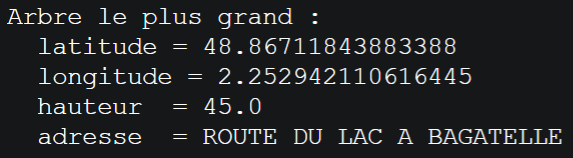
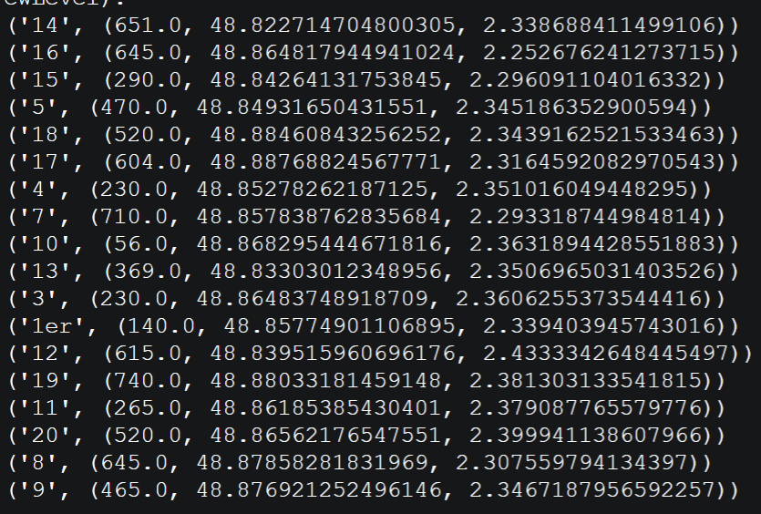
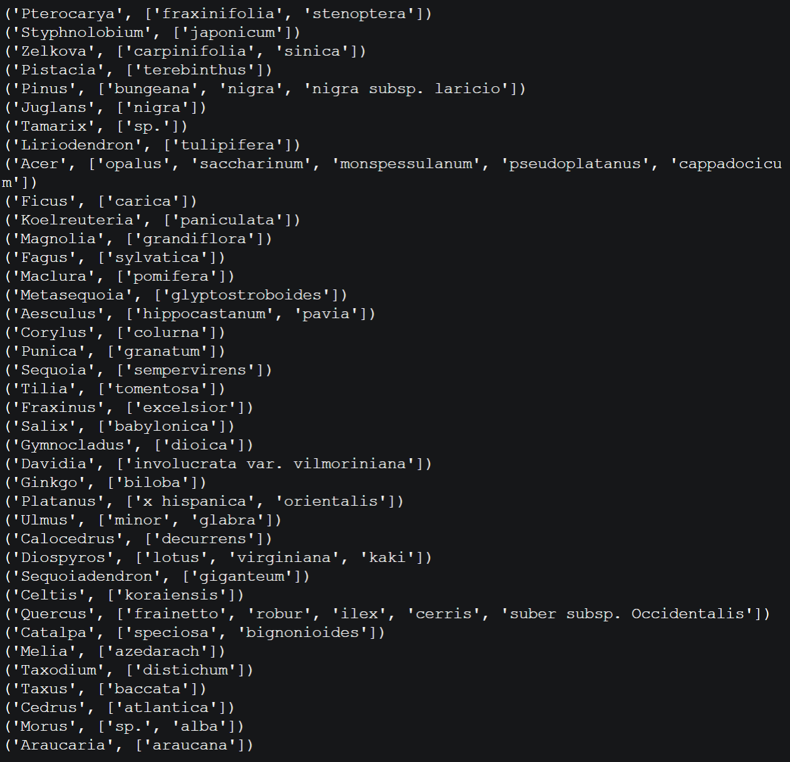
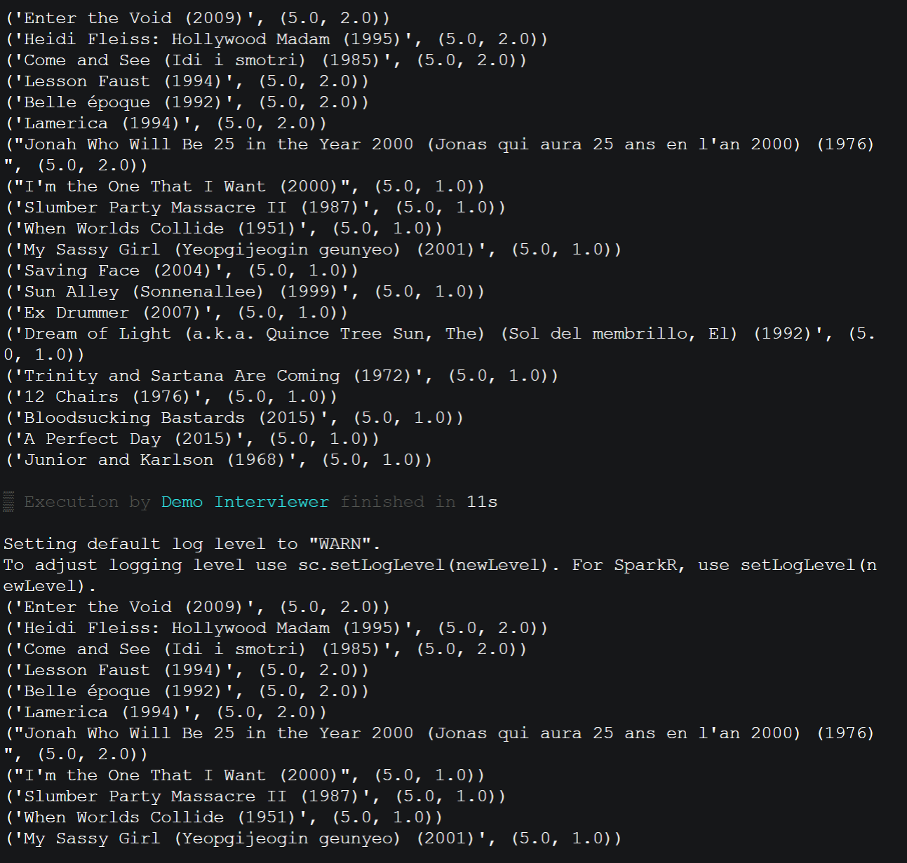

# TP Spark

Etant donné que le réseau de conteneurs docker ne fonctionne pas (`hadoop-master:9000` injoignable), et que PySpark ne fonctionne pas sur ma partition Windows (malgré avoir `pip install pyspark`, en ayant dékà Java, en ayant installé Spark et Hadoop et autres choses que divers tutos faisaient installer), et que je n'ai pas encore configuré ma partition Kubuntu, j'ai fait le TP sur https://codeinterview.io/languages/pyspark, en ré-important les CSV et le code Python toutes les 5 minutes après être éjecté de la démo gratuite, et on ne peut pas copier la sortie standard.

En conséquence :

- je n'ai que des captures d'écran des résultats et non le texte.
- mon voisin m'a largement aidé pour la toute première question, afin de rattraper mon retard.

## Exercice 1 : retrouver un arbre remarquable

NB: j'ai remplacé à la main le retour chariot par un `\n` pour que 1 ligne du fichier = 1 arbre, ainsi que retiré la première ligne du nom des colonnes.

### Arbre le plus grand

Mon code est sensiblement le même que celui de mon voisin.

Chaque ligne du fichier est transformée en liste de longueur constante grâce au parseur CSV natif de Python.
Puis, pour chaque ligne, on extrait les colonnes qui nous intéressent, en mettant en clef la hauteur de l'arbre et le reste dans la valeur.

Ainsi, la ligne `tallest = infos.max()` prend l'élément avec la plus grande valeur, c'est-à-dire l'arbre avec la hauteur la plus élevée.

```py
from pyspark import SparkContext
import csv

def parse_line(line):
    try:
        row = next(csv.reader([line], delimiter=';', quotechar='"'))
        return row
    except Exception:
        return None

def extract_info(row):
    coord_field = row[0].strip()
    lat_str, lon_str = [s.strip() for s in coord_field.split(',', 1)]
    lat = float(lat_str)
    lon = float(lon_str)
    height_str = row[8].strip()
    if height_str == '':
        print(row)
        return None
    height = float(height_str)
    address = row[6].strip() if len(row) > 6 else ''
    return (height, (lat, lon, address))

if __name__ == '__main__':
    sc = SparkContext(appName='TallestTree')
    file = sc.textFile('arbresremarquablesparis2.csv')
    parsed = file.map(parse_line).filter(lambda r: r is not None)
    infos = parsed.map(extract_info).filter(lambda x: x is not None)
    if infos.isEmpty():
        print("Aucun enregistrement avec hauteur valide trouvé.")
    else:
        tallest = infos.max()
        height, (lat, lon, address) = tallest
        print("Arbre le plus grand :")
        print("  latitude =", lat)
        print("  longitude =", lon)
        print("  hauteur  =", height)
        print("  adresse  =", address)
    sc.stop()
```



### Coordonnées GPS des arbres de plus grande circonférence par arrondissement de Paris

On modifie le code de la question 1 pour récupérer d'autres colonnes, en mettant l'arrondissement en clef, et la circonférence en clef de la valeur : `return (arrondissement, (cinconference, lat, lon))`.

Ainsi, avec `.reduceByKey(lambda v1,v2 : v1 if v1[0] > v2[0] else v2)` on groupe par arrondissement, et on sélectionne seulement la valeurs dont la circonférence est la plus élevée.

```py
from pyspark import SparkContext
import csv

def parse_line(line):
    try:
        row = next(csv.reader([line], delimiter=';', quotechar='"'))
        return row
    except Exception:
        return None

def extract_info(row):
    coord_field = row[0].strip()
    lat_str, lon_str = [s.strip() for s in coord_field.split(',', 1)]
    lat = float(lat_str)
    lon = float(lon_str)
    arrondissement = row[21]
    cinconference = float(row[7])
    return (arrondissement, (cinconference, lat, lon))

if __name__ == '__main__':
    sc = SparkContext(appName='TallestTree')
    file = sc.textFile('arbresremarquablesparis2.csv')
    parsed = file.map(parse_line).filter(lambda r: r is not None)
    infos = parsed.map(extract_info).filter(lambda x: x is not None).reduceByKey(lambda v1,v2 : v1 if v1[0] > v2[0] else v2)

    print(*infos.collect(), sep="\n")
    sc.stop()
```



### Espèces d'arbres, triées par genre

Sur la page Wikipédia de [Genre (biologie)](<https://fr.wikipedia.org/wiki/Genre_(biologie)>) :

> En systématique, le **genre** est un rang taxonomique (ou taxinomique) qui regroupe un ensemble d'**espèces** ayant en commun plusieurs caractères similaires.

L'extraction des données utiles est encore plus direct ici.

Avant de grouper, un `.distinct()` permet d'éviter les couples identiques, car `.groupByKey()` se contente d'ajouter les éléments à des générateurs, donc sans savoir si l'élément à ajouter est déjà présent (ce qui est évident : on consommerait le générateur si on le parcourrait pour vérifier les doublons).

Ainsi, à chaque genre on associe la liste des espèces, en sachant que les tuples `(genre, espèce)` sont uniques.

```py
from pyspark import SparkContext
import csv

def parse_line(line):
    try:
        row = next(csv.reader([line], delimiter=';', quotechar='"'))
        return row
    except Exception:
        return None

def extract_info(row):
    genre = row[11]
    espece = row[12]
    return (genre, espece)

if __name__ == '__main__':
    sc = SparkContext(appName='TallestTree')
    file = sc.textFile('arbresremarquablesparis2.csv')
    parsed = file.map(parse_line).filter(lambda r: r is not None)
    infos = parsed.map(extract_info).filter(lambda x: x is not None).distinct().groupByKey()

    liste = [(k, list(v)) for k, v in infos.collect()]
    print(*liste, sep="\n")
    sc.stop()
```



## Exercice 2 : The MovieLens Database

Pour gagner du temps, j'ai choisi une requête qui n'utilise que deux fichiers, mais qui se veut utile : quels sont les films les mieux notés ?

NB : j'ai retiré la première ligne des CSV pour éviter de compter les noms des colonnes.

Pour les films, on crée les tuples `(id, titre)` et pour les ratings, les tuples `(id, rating)` : ceci permet de faire la jointure entre les deux (jointure interne : si un film n'a pas de titre ou aucune note, il ne m'intéresse pas) dans la variable `jointure`.

Ensuite, `titre_vers_rating` élimine l'identifiant désormais inutile : le titre est la clef, un rating est la valeur.

Enfin, le calcul de la moyenne avec des pondérations qui s'accumulent est une reprise de la partie 1.

```py
from pyspark import SparkContext
import csv

def parse_line(line):
    try:
        row = next(csv.reader([line], delimiter=',', quotechar='"'))
        return row
    except Exception:
        return None

def moyenne_poids(tuple1, tuple2):
    v1, p1 = tuple1
    v2, p2 = tuple2
    return ( (v1*p1+v2*p2) / (p1+p2), p1+p2)

if __name__ == '__main__':
    sc = SparkContext(appName='TallestTree')
    movies = sc.textFile('movies.csv').map(parse_line).filter(lambda r: r is not None).map(lambda row: (row[0], row[1]))
    ratings = sc.textFile('ratings.csv').map(parse_line).filter(lambda r: r is not None).map(lambda row: (row[1], float(row[2])))
    jointure = movies.join(ratings)
    titre_vers_rating = jointure.map(lambda row: (row[1][0], (row[1][1], 1.0)))
    rating_moyen = titre_vers_rating.reduceByKey(moyenne_poids).sortBy(lambda row: row[1], ascending=False)

    print(*rating_moyen.collect()[:100], sep="\n")
    sc.stop()
```


