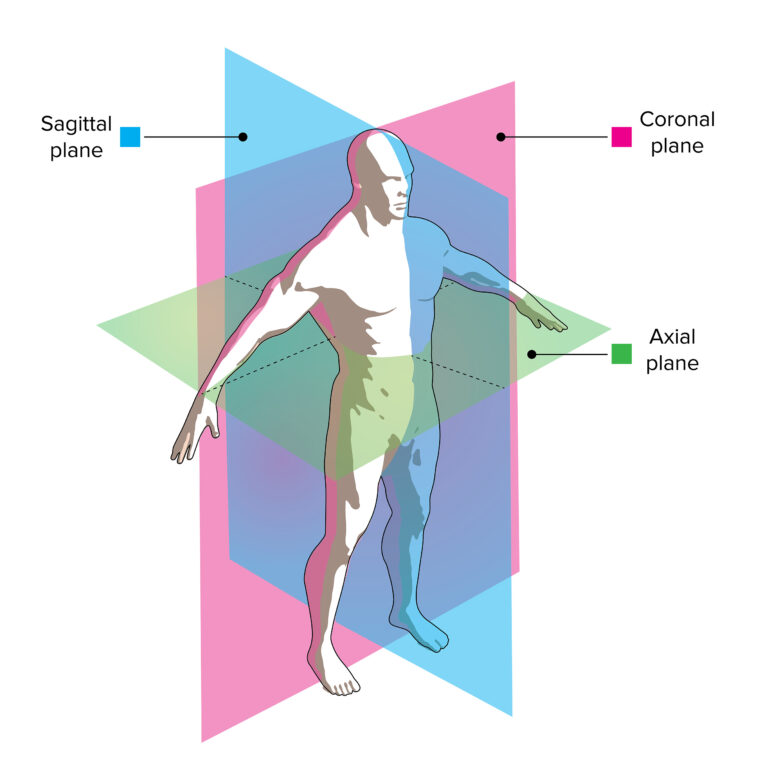

# CV & AI pr l'imagerie médicale, chez General Electric Healthcare

> Pas sûr du titre, j'avais partiel jsuis arrivé 2mn en retard mdrr

Thèse en traitement d'images pr détec des tout ptits trucs.

## Intro à l'imagerie médicale



types de visualisations :

- volume rendering : rendu 3D de tout, en couleurs
- Mesh rendering : pas de couleurs, juste un bout
- Curved view : intéressant, on projette un "vaisseau" ds un plan, comme ça on peut le suivre
- Lumen view : ...

12-bit detector pr le médical : [0; 4095].
Hounsfield units

Gros c incroyable, il clique sur un bouton et paff la radio 3D affiche le foie en vert etc chaque organe en sa couleur, c réel !!!

Ils utilisent pas des formats "classiques" ms le format DICOM, c un standard international.
C le format pr l'industrie, interopérable avec bcp de trucs ; pr la recherche y a 2 autres formats bcp + "simples" genre en NiFTI c l'img 3D brute, tous les viewers open-source ut ce format.

Comme en imagerie classique : là un volume de 512 de côté et de 16 bits (2 octets) par voxel, ça prend 256 Mo

## CV for medical applications

Avant AlexNet en 2012, on avait des opérateurs :

- gradient based : Sobel, Canny, ...
- segm :
- feature extr : Surf, ...
- filtering : Gaussian, ...
- ...

Libs Python open-source classiques :

- OpenCV le GOAT
- PIL
- scikit-image
- ITK

## Opti of the perfs in prof

Rappel convolution :

$$
(f * g)(x) = \int_{- \infty}^{+ \infty} f(x - t) g(t) dt = \int_{- \infty}^{+ \infty} f(t) g(x - t) dt
$$

Exemple du mean filter : le kernel c un carré avec que des 1.

Cmt l'implémenter en C++, cmt on va l'opti ?

Impl naïve

Code optimization rules :

1. Unit test: make sure the results are the same after optimization: c la correction algorithmique,
2. Bench -> make sure the optimization doesn't break intern optimization: eh oui le compilateur il s'attend sûrement pas à des dingueries du genre `a = a ^ b; b = a ^ b; a = a ^ b;`


Rpz-ation interne dla mem: c un array 1D, donc pr ranger la matrice on peut être en row-major (défaut, mathématique, la mat c une liste de lignes) ou tester du column-major (liste de colonnes).

Typiquement un parcours de matrice, on ferait "for (Y) {for (X) { ... }}", en pratique le compilateur a déjà pris ça en compte donc ça change rien qd on benchmark les perfs de ça.

On peut ajouter un `#pragma omp parallel for` au-dessus des boucles : c OK car chaque thread peut lire partout ms écrire qu'à un endroit, donc on aura pas de race condition.
Et là, 84% d'amélio !

Askip le CPU aime pas trop les "if" (les `jne` et `je`, bref le branching).
On peut couper des conditions and pr remonter certaines parties pr éviter des boucles inutiles :

```
for (y) {
    for (x) {
        if (f(x) && g(y)) ...;
    }
}
```

Devient :

```
for (y) {
    if (g(y)) for (x) {
        if (f(x)) ...;
    }
}
```

Mtn on prend du recul et on regarde algorithmiquement : ce noyau est séparable
$
\begin{bmatrix}
1 & 1 & 1 \\
1 & 1 & 1 \\
1 & 1 & 1
\end{bmatrix} = \begin{bmatrix}
1 \\
1 \\
1 \\
\end{bmatrix} \times \begin{bmatrix}
1 & 1 & 1 \\
\end{bmatrix}
$.

Oh le pre-shot ! On calcule une _img intégrale_ où chaque valeur c la somme du rectangle en haut à gauche de ça.
C trivial à calculer vite, et en 4 accès en $O(1)$ on fait des sommes et différences de rectangles attachés au coin en haut à gauche pr pouvoir avoir la somme des pixels de n'importe quel rectangle !

Par contre en C++ ça va overflow sur une résolution de bcp $\times$ bcp $\times$ bcp (oui j'ai pas dit ms c des img en 3D).
Ms on se rappelle que ce noyau est séparable : on accumule que en 1D ms 3 fois (au lieu de 3D), comme ça ça devrait pas overflow.

A ce stade, c 22 000 fois + rapide que l'implémentation naïve sur son benchmark et on est passés en $O(n)$ (#pixels) : on a plié le game.

Cache optimization (minimiser les cache miss) : cmt se servir de L1 L2 L3 plutôt que de la RAM ?
Bon il a présenté la solution ms j'ai pas trop capté, en gros on traite les "lignes" par paquets de taille `BLOCK_SIZE`, ça dmde d'allouer + de mémoire ms tqt c + rapide.

Comparaison : son algo met 0,6 ms, ITK met 13 minutes, c 1,5 MILLION de fois + lent !

On peut aller encore + vite, en ne faisant pas de branching, en utilisant un GPU qui traite indépendamment chaque pixel, en faisant du SIMD (Single Instruction Multiple Data), etc.

Le SIMD : en gros les registres contiennent pas mal de bits, donc en stockant "multiple data" ds un seul registre, on peut faire "plusieurs" choses en une seule instruction mémoire !
