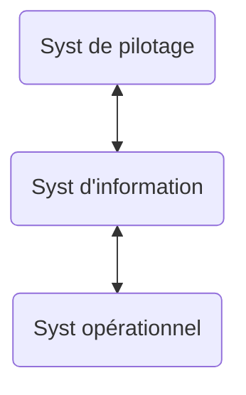
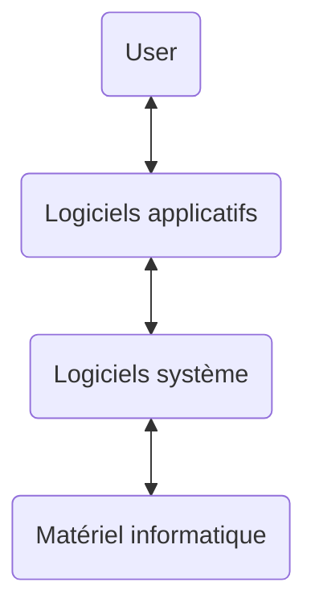
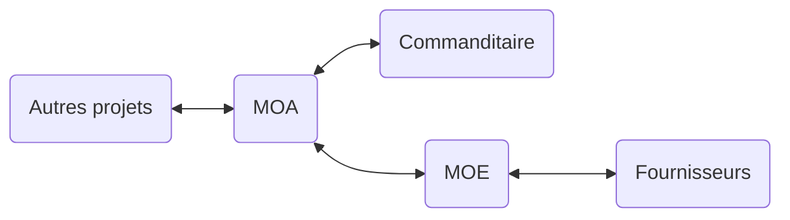

# 1. Introduction

On va voir :

- Général
    - C quoi un SI
    - Y a quoi deds
- User du SI
    - Cmt utiliser le SI ds nos projets
- Membre du SI
    - Cmt un SI est construit
    - Cmt modifier un SI
    - Cmt gérer un SI
    - Connaître le coût d'un SI

## Contenu du cours

### Ce qu'on va aborder

- C quoi un SI
- Archis $n$-tier
- Rôle des processus
- Urbanisation du SI
- SOA : archis orientée services
- SaaS & cloud computing
- Bonnes pratiques & normes
- Mesures et coûts du SI

### Ce qu'on va pas aborder

- Méthodes de conception d'un SI
- Protocoles de communcation
- db & SGBD
- Génie logiciel & cycle de vie d'un projet
- Programmation

## C quoi un SI ?

Exemple de Centrale :

- Qui ?
    - DSI (Directeur ici, pas Direction)
    - CRI (Centre de Ressources Informatiques)
- Quoi ?
    - Apps de l'école
    - Réseau (Wifi + Ethernet)
    - Ordis du personnel
    - Salles machines (H9)
- Cmt ?
    - 22 personnes (autant ?)
    - Modélisation & archi -> DSI
    - Mise en oeuvre : CRI

La déf s'étend avec le tps; le traitement automatisé en ep, ça ds les 70s, et avec les 90s le SI devient un élém structurant d'une orga, gérant matériel, logiciel, personnel, données, procédures, pr acquérir, traiter, stocker, communiquer.

Le SI, c :

> Une modélisation du syst physique (informatique) permettant le traitement de l'information

C constitué d'au moins :

- Processus (comportement par/à des actis & events en accord avec la strat dl'orga)
- Organigramme (qui ?)
- Système informatique (struct physique)

## Le SI : un Syst

L'objectif du SI : c de fournir des services informatiques !

Perspective de syst : boîte noire

### Métier != service

Exemple à Centrale : la partie métier c l'enseignement aux élèves et la recherche en labo.

Ms du pdv dla DSI, souvent métier = le reste de l'ep (prod, logistique, épicerie, RH, compta, ...)

L'entrée du SI c un portefeuille de projets.
Y a des déchets.
Et la sortie c des services informatiques.

- Syst de pilotage (dl'orga): régulation, contrôle, décision, déf d'objectifs
- SI : interface ; envoie les directives du syst de pilotage au syst opérant
- Syst opérationnel : réalise les actions : c le syst informatique

## Processus & systs de trav

Déf: "SI" := triplet $\{$ processus, acteurs, ressources $\}$.

- processus : suite ordonnée de tâches. Ordonnancement parallèle ou séquentiel
- tâche : action élémentaire, dmdée par l'ep
- ressources : informatiques, tél, lettre, etc
- acteurs : personnes, logiciels, machine

## SI & syst informatique

### Rappels UML

- diagrammes de :
    - cas d'ut
    - classes
    - séquence & collab
    - états-transitions & d'actis
    - composants & de déploiements
- Vue statique du syst : classes, objets, composants, déploiement
- Vue dynamique du syst : cas d'ut, collab/com', séquence, états-transitions, actis

Y a BPMN aussi, sorti en mm tps par le mm grp de trav

Déf: "syst informatique" := triplet $\{$ applicatifs, matériels, progiciels $\}$.
C la vérité terrain.

Le SI s'appuie sur le syst informatique $\implies$ on peut pas créer un SI stable sans connaître cmt fonctionne le syst informatique.

Corollaire : le syst informatique est la base de l'archi du SI

Le SI c une usine à services.
Les ressources sont machines ou logicielles.

- Logiciel
    - Déf : traitement automatique d'un ens d'infos par une machine.
      C composé de programmes (suites d'instructions), de données, de docu.
    - 2 catégories
        - logiciel applicatif : destiné à assister directement l'user ds ses tâches.
            - Progiciel : contractions de produits logiciels, c les logiciels applicatifs prêts à l'emploi, standards & génériques, prévus pr rép à des besoins ordinaires.
            - Applications : dévs pr rép à un besoin spécifique, par une équipe dédiée. Leur dév est onéreux, et sont pas dispo ds le commerce
        - logiciel système : dont les automatismes contrôlent l'ut du matériel informatique par les logiciels applicatifs.
            - OS : contrôle l'ut du hardware par du logiciel.
              Permet l'utilisation dla puiss de calcul et gestion dla mémoire.

## Maîtrise d'ouvrage vs maîtrise d'oeuvre

Maîtrise d'ouvrage (MOA) : donneur d'ordres, c pas ds la réalisation

Maîtrise d'oeuvre (MOE) : va concevoir et réaliser le produit.
C aussi le gestionnaire de moyens ; le MOE se présente comme un fournisseur de services

Par exemple ds un PE en 0A, la MOE c nous les 0A, la MOA c les encadrants (école, conseillers, etc).
