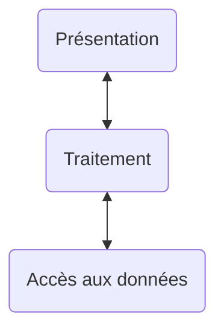

# 2. Architectures techniques

Historique :

-   Archi 1 tier : _mainframe_ ou modèle centralisé, des 70s
-   Archi 2 tier : client-serveur
-   Archi 3 tier : distribué, web

## Archi 1 tier : _mainframe_ des 70s

Apps monotlithiques (indissociables).
Tte l'informatique dl'ep est concentrée ds 1 seul serveur unique, appelé le mainframe.

C des apps très robustes, qui assurent la disponibilité et l'intégrité des données.

Coûts élevés d'acquisition et d'installation.

## Archi 2 tier : client-serveur

Ds les 80s, les ordis persos sont apparus, ils se mettent en réseau : y a un besoin de partager l'information.

Les servs pr la persistance, les clients pr les composants d'interface.

Faible coût.

Ms faut tenir le client à jour, et ça c vachement embêtant (oui).

## Archi 3 tier : distribué, web

WebApp à partir de fin 90s : on accède désormais aux apps via le navigateur.

Faible coût.

Maintenance bcp + basique des ressources applicatives.

Rq : le découpage en _nivs_ est hyper courant en modélisation de systs.

### Distribué

Avec un load balancer et plusieurs "serveurs" derrière.

### Archi $n$-tier

Plusieurs une façon de parler, qd on a $n$ servs, ms bon.

## Bilan sur les différents types d'archis

## Eléms de réseau
