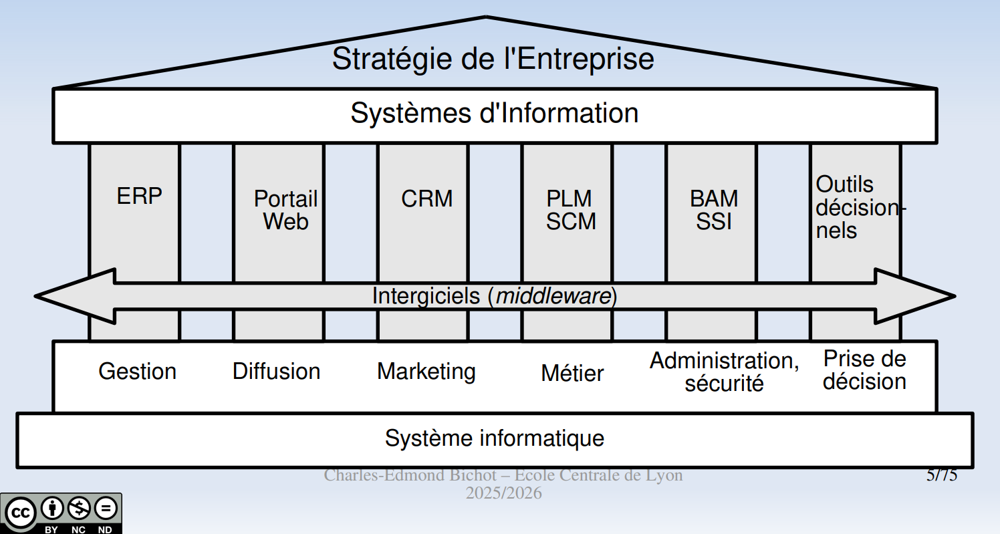

# Les grdes constituantes du SI en ep

LEs composants du SI dl'ep

## ERP : gestion

_Enterprise Ressources Planning_ ("Progiciels de Gestion Intégrés")

- Outils de gestion des processus opérationnels (~métier) dl'orga : vente, distrib, approvisionnement (~supply chain), e-commerce
- Intègre en géénral les ppales composants fn-elles dl'ep : gestion dla prod, commerciale, logistique, RH, compta, ...
- Bref c un sys unifié : une db _unique_

### Avantages

Donc carac ppales :

- db unique : pas de ressaisie (gain de tps & pas d'erreur), disponibilité, non-redondance.
- saisie unique des donénes
- IHM hmgnes
- tps réel
- modularité (s'adapte à bcp de SI) & généricité (adaptable à bcp de secteurs/d'ep)
- portabilité (hostable sur plusieurs OS, branchés sur différents SGBD (DBMS))

C un outil de back-office. > 90% de grdes ep ut un ERP, 75% des ETI, 45% des TPE.
Les éditeurs les + connus sont SAP, Oracle, Microsoft Dynamics, Salesforce, CEGID (Fr, et mm lyonnais!), Odoo (open-source, avant ça s'appelait _OpenERP_), Dolibarr (open-source), etc.
Fournis en mode SaaS (Software aaS) en général.

### Inconvénients

- Lourdeur : coût de mise en oeuvre, difficulté d'appropriation, couvre pas 100% des besoins, requiert en ft une bonne connaissance des processus dl'ep
- Mise en ouvre délicate : 30% des impl échouent, seulement 27% des ERP sont livrés à temps, 44% des projets d'ERP répondent mm pas aux attentes des users, et seulement 40% des ERP délivrent les bénéfices attendus.

### Exemple

SAP :

- c relativement moche, y a trop de menus partout
- on peut avoir des fn qui run sur déclenchement, elles sont écrites en ABAP... un successeur de COBOL (bruh).

## Portail web : diffusion

Entryppoint unique du SI.
Objectifs : agréger les interfaces web.

Le portail d'ep offre 4 types d'apps: B2E (Employee), B2B, B2C, et com' entre l'ep et le public

- B2E : WebApp pr amélio la productivité en améliorant la com' interne dl'ep, (e.g. mail, rallly, com')
- B2C : e-commerce, pub, pr la màj des stocks, automatiser facturations & compta
- B2B : amélio la productivité des échanges avec les partenaires, gestion automatisée des clients

## CRM : marketing

_Customer Relationship Management_ ("Gestion des Relations avec le Client") : ens de produits pr la gestion des relations client, le but c de fidéliser le client en analysant son comportement.

C un otuil de "front-office".
Composantes ppales :

- écouter le client pr le connaître
- efficacité des transactions (fidéliser sur le long terme)
- dialogue avec le client (personnalisation, N canaux de com')

En Fr, 64% des PME ut déjà un CRM, le marche >$100B, dont 3,2 en Fr

Le CRM se base sur... une base de donénes (waw) : accès aux infos clients, produits, croiser les besoins clients / produits, liste des produits déjà acquis, stats / dashboards / analytics, affaires commerciales, campagnes marketing, etc.

Editeurs : the usual suspects (SAP, Oracle, Salesforce, MS Dynamics, ~~OpenERP~~ Odoo).

3 parties du CRM : opérationnel, analytique, collaboratif

## Progiciels métier

### PLM

_Product Life Management_ ("gestion du cycle de vie d'un produit")

Sert à gérer ttes les infos reliées à un produit tt au long de sa vie : conception (CAO), fabrication, commercialisation, évol, recyclage, etc., les différentes versions, les docs qui vont avec le produit, nomenclature, documentation, etc., avis des clients, plaintes, coûts de prod, hist de vente, etc.

The usual suspects : IBM, Oracle, SAP, Dassault

### SCM

_Supply Chain Management_ ("gestion de la chaîne logistique")

Sert à gérer l'ens des flux de matières, marchandises et produits, depuis l'approvisionnement jusqu'à l'end-user.

2 actis clefs :

- planification : stratégique (long terme, années, survie dl'ep), tactique (cmt amélio la situ ds les prochaines smn/mois), et opérationnelle (now)
- prévision : idem, court, moyen & long terme

Outils :

- APS (_Advanced Planning & Scheduling_) : planif dla chaîne en fn des dmdes prévues & ressources dispos
- SRM (_Supplier Relationship Management_) : gère l'approvisionnement auprès des fournisseurs

### "Scope"

## Intergiciels : middleware

Transversal : y a un "bus logiciel", les communications entre logiciels passent par l'intergiciel.

L'intergiciel est chargé de l'_intégration_ des apps ds le sys (et donc est extérieur à cette réalité : l'intergiciel ne compte ni parmi les apps, ni parmi les sys !)

Ca permet aux "acteurs" du SI de s'envoyer des _messages_ (au sens IPC (/ RPC)).

C au centre (oui en étoile, c un Single Pt of Failure mdrr) ms ça fournit une API consistente pr interfacer des apps htrgn entre eux.

Composants du middleware :

- _Format and Protocol_ (FAP) met en forme les données niveau réseau
- L'API

### EAI

_Enterprise Application Integration_ : justement pr les échanges d'infos entre apps htrgn, ça centralise les flux d'info ds l'EP.

The usual suspects : MS (BizTalk), BlueWay, SAP, BEA, IBM, Oracle

C un orchestrateur en qq sorte.

Par contre c cher, c chiant à deploy, à param, c propriétaire donc l'ep finit locked-in (dépendant de l'éditeur de logociel qui a fait l'EAI)

### ESB

_Enterprise Service Bus_ ("Bus d'Entreprise")

Ce sont des intergiciels compatibles avec l'archi orientée service (SOA), c standardisé donc l'ep est indépendante du syst (indép du procole de com', de la techno/stack, etc.).

Gestion async des msg, services web, etc.notion de service conteneurisé, etc.

## Les autres éléms du SI : décideurs

L'informatique décisionnelle, ou informatique économique (_Business Intelligence_, BI)

Benchmarking, dashboards, prévisions, ...

db, sysadmin, la GED (rappel du stage : Gestion Electronique des Documents), SAE (Sys d'archivage Electronique), etc.
