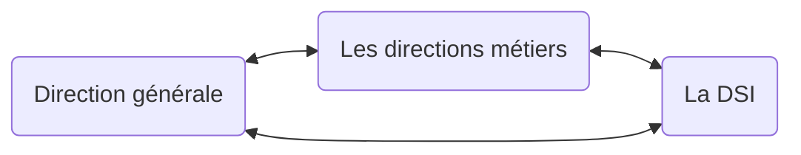

# La place du SI

La DSI pdt lngtps était considérée comme juste un fournisseur d'IT

La DSI _rend_ un service, c là son but, et n'_impose_ jms un service

4 services ppaux deds :

- Support actis
- Prod : service desk, contrat maintenance, assist
- Dév : hard- & software, tests, pré-prod
- Archi

En en, le DSI (directeur) c le CIO (_Chief Information Officer_).

Les autres employés là ils sont vrmt ingrats, ils se rendent pas compte du service que la DSI leur apporte.

Modèle d'alignement de Henderson & Venkatraman : y a 4 formes d'alignement stratégiques des SI

- Exéc opértionnelle dla strat dl'ep à trav les processus opértionnels métiers
- Adaptation dla strat dl'ep, qui aboutit à mettre en place un nouveau SI
- SI à l'origine dla strat en mettant en places de nouvelles technos
- SI prestataire de services : edit des processus métiers pr amélio la qualité du SI

La gouvernance c le "pilotage non-opérationnel" (par oppositioon au management), elle donne la direction/l'orientation/la strat.

La DSI fournit ses services exclusivement aux autres départements de l'ep, s'adapter turbo vite aux nouvelles technos, tjs évoluer.

## Responsabilités

Matrice RACI :

- Accountable : l'unique responsable final
- Resposanble : le MOE (maître d'ouvre) de l'opération, il
- Consulted : doit être consulté pr cette tâche
- Informed :

Ex :

1. construire le bon SI en taille et pérmimètre, c le ComEx en R qui porte, et le DG (directeur général) A qui rend compte.
   Ouais c choquant que la DSI elle-mm soit ni A ni R ms bon.
2. La valeur délivrée par les services informatiques, là c les directions métiers A qui sont respos, et la DSI R est co-respo.
3. Le respect dla qualitwei de service, c la DSI A qui gère ça direct et rend compte aux directions métiers R.
4. Créer et réaliser le portefeuille de projets, c le ComEx R qui est respo, ms c la DSI A qui coordonne ça et doit rendre des comptes.

Forte collab/négociation entre DSI et les directions métiers, c nécessaire étant donnée la complexité des tâches.

## Les actueurs du SI

- La DSI
    - Les directions métier : ont des reponsabilités opérationnelles
    - Responsable de domaine fonctionnel : maintient à jour la cartographie (?), analyse l'évol des specs des apps (?) (c quoi ce BS job...)
    - Urbanistes : portent la démarche d'urbanisation, ils ont la visiion globale et transversle du SI
    - Architecte fn-el : le job du gars peut être fait par une team, il sert à rien, sauf en début de projet.
    - Architecte technique : définit les choix et standards en infra (serveurs, réseau, postes de trav, IDE, db)
    - Responsable projet : selon les entreprises, on peut avoir plusieurs respos pr 1 projet, ou 1 respo de plusieurs projets
    - Equipe projet

## Les métiers liés au SI

- R&D
    - concepteur, "dév"
    - analyste fn-el
    - consultant progiciel
- Prod
    - Technicien d'infra
    - Admin d'infra
    - Expert infra
    - Support client
    - Pilote d'exploitation
    - Intégrateur
    - Chef de projet prod
- Conseil
    - Assistance MOA (maîtrise d'ouvrage)
    - Consultant métier
    - Urbaniste
    - Consultant technique
    - Archi technique
    - Archi IT
- Département archi
    -
