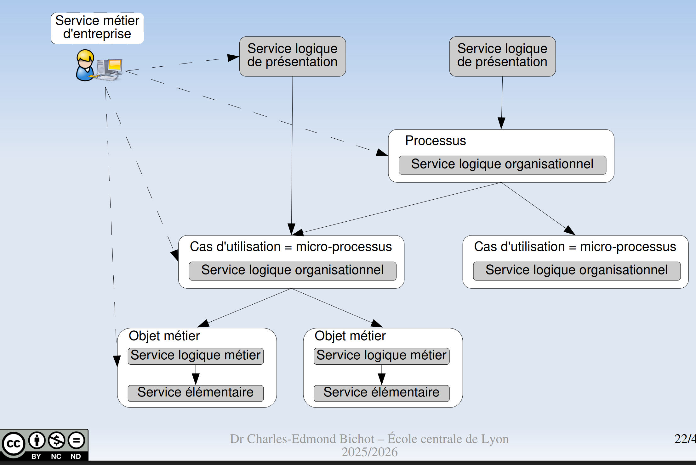

# L'architecture orientée services (SOA)

C un modèle d'architecture pr l'unification du SI, où la brique élémentaire c le _service_.

Un service est _contractualisé_ entre un consommateur (le service caller) et un pourvoyeur (le service callee).

Pr l'end-user, la plus-value c des apps composites ms unifiées.

## La démarche SOA

Services hautement réutilisables

## Catégories de services

4 catégories

- SLP : Service Logique Présentation : UI, expose l'IHM à l'end-user
- SLO : Service Logique Organisation
- SLM : Service Logique Métier : business logic
- SLE : Service Logique Elémentaire

### Services _batches_ : traitement par lots

Batch processing, enchaînement automatique de commandes.

### Couplage faible

Le consommateur invoque le pourvoyeur indépendamment des technos de transport.

Le consommateur ignore l'identité du fournisseur (faut juste qu'il respecte l'interface, c de l'injection de dépendances).

Communication par messages (ça me ft penser aux DTOs).

Conception par contrat

Moyen : pré- et post-conditions.
Bon c du type-checking, les pré-conditions c valider le schema envoyé par le client, les post-conditions c valider le schema de ce qu'on s'apprête à renvoyer.

C assez haut niveau et conceptuel...
