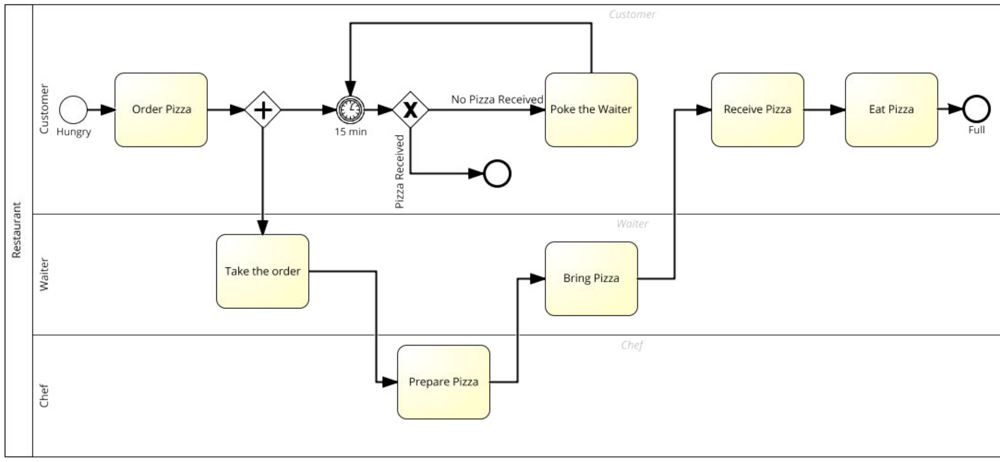

# 1. BPMN

Complémentaire de la notation UML, assez récente, en + c une norme ISO

Y a :

- des flux entre processus,
- des pistes & corridors qui sont les acteurs ds un processus
- des activités (les tâches)

# 2. Modelisation du processus de commande d’une pizza (1 heure)

## Correction pizza commandée

