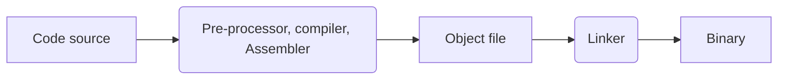

# Technologie des objets connectés

## 1 - Capteurs

Archi globale

## 2 - CPU/MCU

Microprocesseur, Microcontrôleur

Struct figée ms souplesse d'un binary modifiable.

Processeur / contrôleur : tps d'exéc $\neq$ car archis $\neq$; le microprocesseur c qd mm un processeur, le microcontröleur c un ALU 8 bits, des blocs matériels (CAN, timers, etc.) et des blocs d'I/O "évolués".

- Microprocesseur (1000+ pins) = 5% du marché
- Microcontrôleur (8-100 pins) = 95% du marché

Comparaison:

- Microprocesseur : archi évoluée, fréq élevée, surcouche logicielle (le hardware est _general purpose_), pas de blocs annexes, détaché du hardware.
  GHz, Giga-Flops, To de stockage, MW de conso
- Microcontrôleur : archi optimisée ds un but précis, fréq faible (conso élec minuscule), pas de surcouche, 10+ blocs annexes, connaissance du hardware.
  MHz, MIPS (_Microprocessor without Interlocked Pipelined Stages_), Ko de stockage, mW de conso

Sys info (CPU) $\neq$ sys embarqué (MCU) : surcouche logicielle (OS) $\neq$ programme brut (sans OS !) donc puissance brute

Ds une clef USB, derrière le connectique y a un microcontrôleur qui a une table d'allocations, et à peine qlq Ko de mémoire, c ce composant qui manipule les Go de stockage derrière.

Mémoire ROM : code machine binary, que le _Program Counter_ parcourt.

Interrupts : Overflow de timers, changement d'état sur certaines pattes d'entrée, comparateur, CAN, etc.
Chaque interruption s'active à l'aide de registres ds la RAM (Memory-Mapped IO ?)

- Microprocesseur : $100 W$
- Microcontrôleur : $100 \mu W$ à $100 mW$, voire descendre jusqu'à $100 nA$ en mode sommeil (le détecteur de fumée dure des années en fonctionnant en permanence).

## 3 - Consommation (énergie)

## 4 - Programmation

Debugger, pts d'arrêts

## 5 - Périphériques

Déf : autres circuits qui apportent des fn-alités, e.g. capteurs, actionneurs, mémoire, éléms de com'

On communique avec en appelant des drivers tout faits : bah ouais on va pas réinventer la roue.

- SPI : Serial Peripheral Interface
- I2C : Inter-Integrated Circuit
- UART : à l'ancienne, on a le TX (transm) de chacun qui va sur le RX (réception) de l'autre

Com' : Wifi (802.11X), NFC, Bluetooth, Zigbee, Lora, 3G/4G
