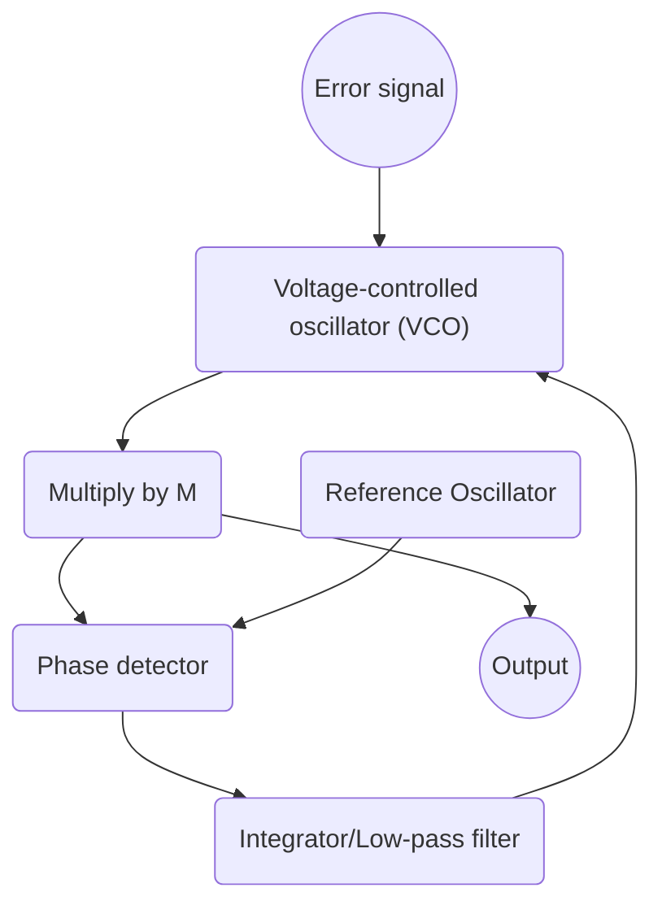
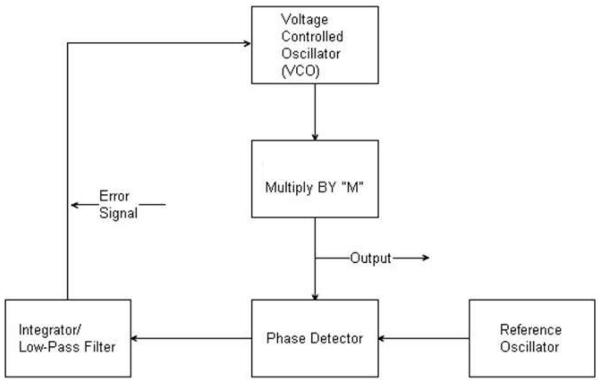

# Introduction aux Réseaux de capteurs sans fil (WSN : Wireless Sensor Networks)

WiFi, Bluetooth tt ça, c super énergivore

Pile Lithium ds les objets connectés ~200 mAh

Node :

- Batterie
- Capteur (prend l'info de l'exté)
- Mémoire
- Unité de calcul & ctrl
- Interface de com' (relaie l'info à l'inté)

Pour moitié, les MCU ds ces petits noeuds ont des archis 8 bits (ouais, 8 bits, 1 octet)., un quart en 16 bits, les autres archis se partagent les miettes du dernier quart.

Quant aux circuits RF (radio-fréquences), c surtout du 802.4 (ZigBee), (rappel 802.11 c Wifi, 802.1X c l'auth), qui envoie du 250 Ko/s, l'idée c que ça consomme peu : 30 µW en veille et 30 mW au repos.

MTU : _Maximum Transportable Unit_, c ça le fameux truc tjs à 1500

Ds l'air ambient y a différentes communications qui coexistent en simultané, ms à différentes fréquences, avec différentes modulations : AM, FM, FSK, PSK, QPSK (Quadrature phase-shift keying), etc.

Convertisseur fréquenec-tension : la tension en sortie est d'autant + élevé que la _fréquence_ de l'entrée l'est (indépendamment du son effectivement transmis).

- Rappel : saut de phase = PSK.
  Ms il me semble que Huillery avait dit que ct pas ouf que ça casse la dérivabilité de la fonction...

## De la communication entre nodes

CSMA-CA : _Carrier Sense Multiple Access with Collision Avoidance_

- IEEE 802.15.4
    - non-beacon
        - CSMA-CA
    - beacon
        - slotted CSMA-CA
        - GTS

## ZigBee

Couches classiques OSI en ZigBee :

- Application
- Application interface
- Network layer
- Data link layer
- MAC layer
- Physical Layer



Bon c le bordel ce mermaid, j'essayais de reproduire le schema du prof :



RX réception TX transmission (envoi)

### Le code du prof ds les slides

```c
// ------------------------------------------------------
// MAIN PROGRAM
void main() {
    disable_interrupts(INT_AD); // désactive INT ADCclear_interrupt(INT_EXT);
    enable_interrupts(INT_EXT); // active INT ext MRF24J40enable_interrupts(global);
    blink2_LED();
    init_mrf();
    while(1)    {
        delay_ms(1000);
        blink2_LED();
    }
}
```

```c
#include <18F26J11.h>
#fuses INTRC_IO,NOPROTECT,NOWDT//,RTCOSC_T1
#use delay(clock=4M)
// Pins
#define MRF_Rst PIN_B3
#define MRF_CS PIN_B2
#define MRF_Wk PIN_B1
#define LED PIN_A5
// Files
#include "global_var.h"
#include "blink.c"
#include "mrf24j40ma.c"
// ------------------------------------------------------
// Extrernal interrupt
#int_ext
void interupt() {
    process_int_ext();
}
```
